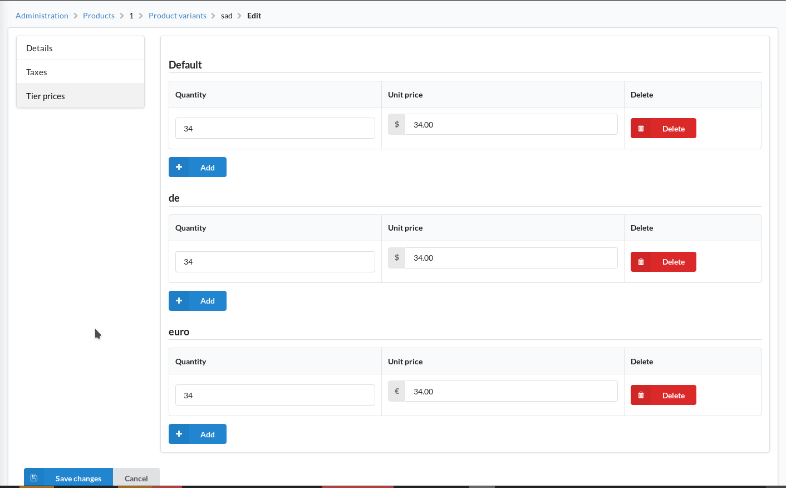
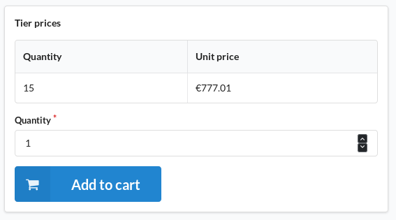

# Tier prices in Sylius
<p align="center"><a href="https://sylius.com/plugins/" target="_blank"></a></p>

[](https://travis-ci.org/Brille24/SyliusTierpricePlugin)

Sylius allows for many different customizations like channels and different prices for different product variants. However, one thing that Sylius is missing is the ability to set the price based on the amount of items the customer wants to buy. This tier pricing methodology can be implemented when this plugin is installed.

## Installation
* Install the bundle via composer `composer require brille24/sylius-tierprice-plugin`
* Register the bundle in your `AppKernel`:
```php
public function registerBundles()
{
    return array_merge(parent::registerBundles(), [
        ...

        new Brille24\SyliusTierPricePlugin\Brille24SyliusTierPricePlugin(),
    ]);
}
```

* Add the `config.yml` and `resources.yml` to your local `app/config/config.yml`
```yml
imports:
    ...
    - { resource: '@Brille24SyliusTierPricePlugin/Resources/config/config.yml'}
```

That way all the Sylius resource overriding happens in the `app/config/resources.yml`

* For API functionality add the bundle's `routing.yml` to the local `app/config/routing.yml`
```yml
...
brille24_tierprice_bundle:
    resource: '@Brille24SyliusTierPricePlugin/Resources/config/routing.yml'
```

* Finally update the database, install the assets and update the translations:
```sh
bin/console doctrine:schema:update --force
bin/console assets:install
bin/console translation:update
```

### Integration
* This bundle overrides the `ProductVariant` class provided by Sylius. If you wish to override the class in your application too, you have to merge the configuration in the bundle's `resource.yml` with your own.
* This bundle decorates the `sylius.calculator.product_variant_price` service. If you wish to change that, you could register a [compiler pass](https://symfony.com/doc/current/service_container/compiler_passes.html).
* This bundle decorates the `sylius.order_processing.order_prices_recalculator` service. If you wish to use your own order processor or change its priority, you could register a [compiler pass](https://symfony.com/doc/current/service_container/compiler_passes.html).

## Usage
First of all you have to set up a product with as many variants as you want. Then in each of these variants you can set the tier pricing based on the channels.
The table automatically sorts itself to provide a better overview for all different tiers, you configured.



In the frontend the user will see a nice looking table right next to the "add to cart" button that shows the discount for the different tiers like so:



### Creating data
You can easily create the tier prices with fixtures like that.
```yaml
sylius_fixtures:
    suites:
        my_suite:
            fixtures:
                tier_prices:
                    options:
                        custom:
                            - product_variant: "20125148-54ca-3f05-875f-5524f95aa85b"
                              channel: US_WEB
                              quantity: 10
                              price: 5
```
For this the products need to be created first and the product variant must also exist.
